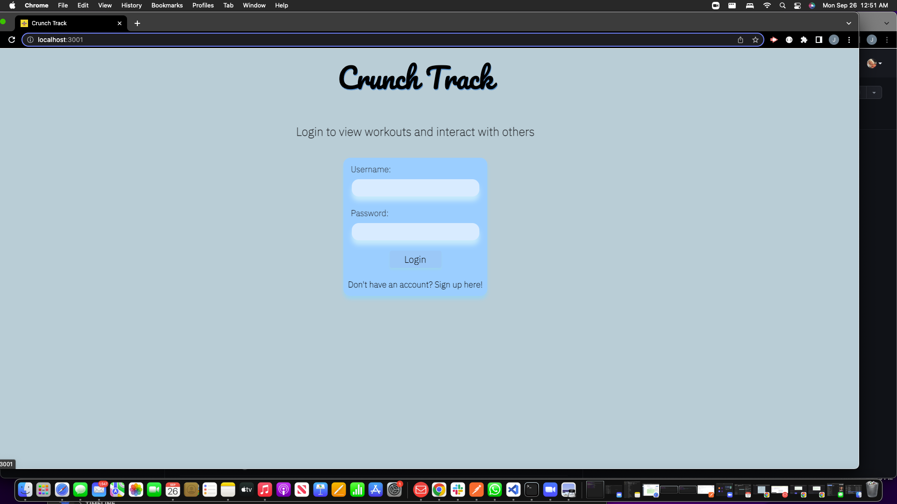
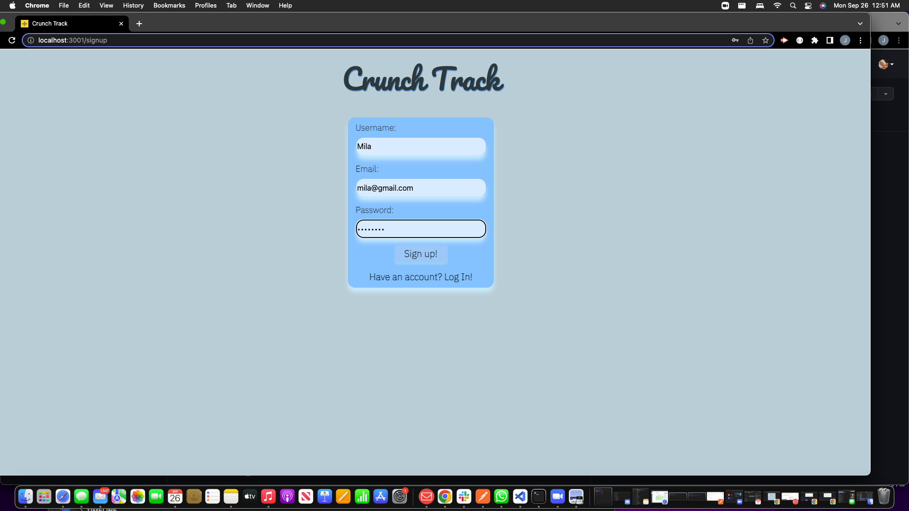
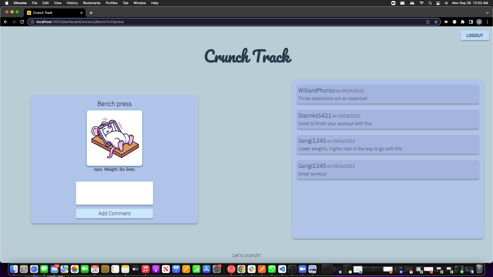
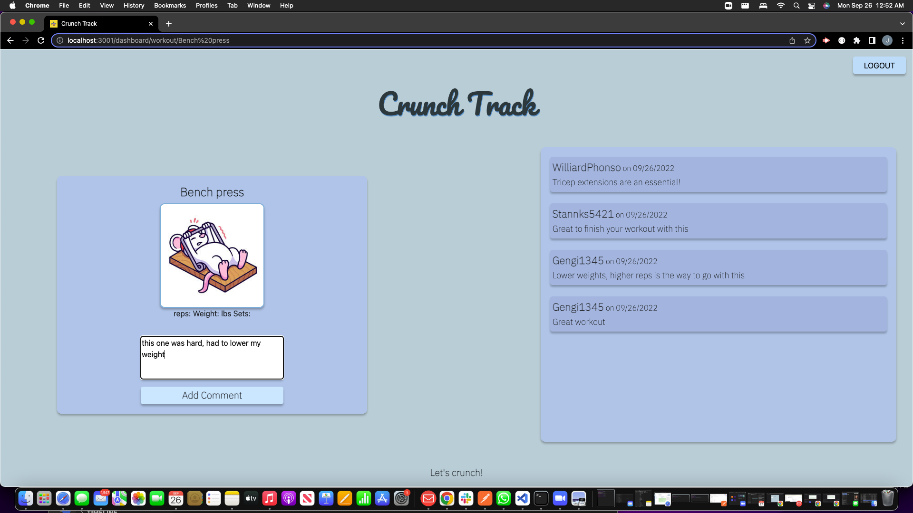
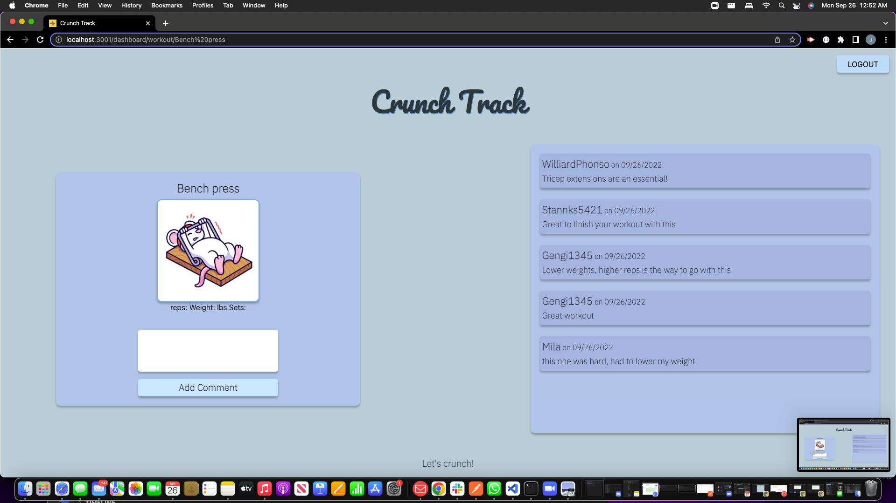

# CrunchTrack

Deployed app: 
https://crunch-track-team-5.github.io/CrunchTrack/ 

Github: 
https://github.com/Crunch-Track-Team-5/CrunchTrack 
  
PowerPoint:
 https://docs.google.com/presentation/d/1bz_zafnAXQU2rJ17ZCdD2IDATAgos_npMCLFVEx4Q2g/edit?usp=sharing

## Table of Contents:
  1. [Description](#Description)
  2. [Usage](#Usage)
  3. [Installation](#Installation)
  3. [License](#License)
  4. [Credits](#Credits)
  5. [Questions](#Questions) 

## Description
Crunch Track is a user friendly app that allows the user to follow a workout routine based on their selections. Crunch Track makes it fun and simple to begin working out and even provides a video to show how to properly complete the exercise.

## Usage 
You'll create an account with Crunch Track and then log in next time you visit. You'll select a workout to complete the exercises included. You can also make any notes on your progress.
 
After entering the page user will be presented with login or signup page in order to continue.
 

 
After loging in user have to make a choice what part of the body exercise will be focused on 
 

 
When the choice is made user will be presented with the list of the exercise for that group
 

 
User can enter every exercise in order to see recommended weight, reps and set or click on the exercise picture in order to be taken to YouTube video
 

 
User will be also able to add a comment, thought or make a note for the future self
<b>

## Installation
From Git Hub repository click CODE box, select SSH and copy the repository to your clipboard. In your command-line navigate to the folder you want to hold the repository. When cloning is completed open th VS code by typing 'code .' in your terminal. After that you will need to open terminal in your VS and create package.json by typing 'npm init' in your terminal. 
You will also have to install mysql, inquirer,dotenv,express,sequelize and nodemon.
Npm run seed
 
Run npm start or node server.js

## Credits
Youtube
 
Google
 
Tutors
 
StackoverFlow 

## Questions
Reach out to us with any questions!
 
Jelena:
 
[GitHub](https://github.com/JelenaTomic)
 
Adriana:
 
[GitHub](https://github.com/Adriana1013)
 
Ivan:
 
[GitHub](https://github.com/Iramirez108)
 
or Nick:
 
[GitHub](https://github.com/Nchirico04)